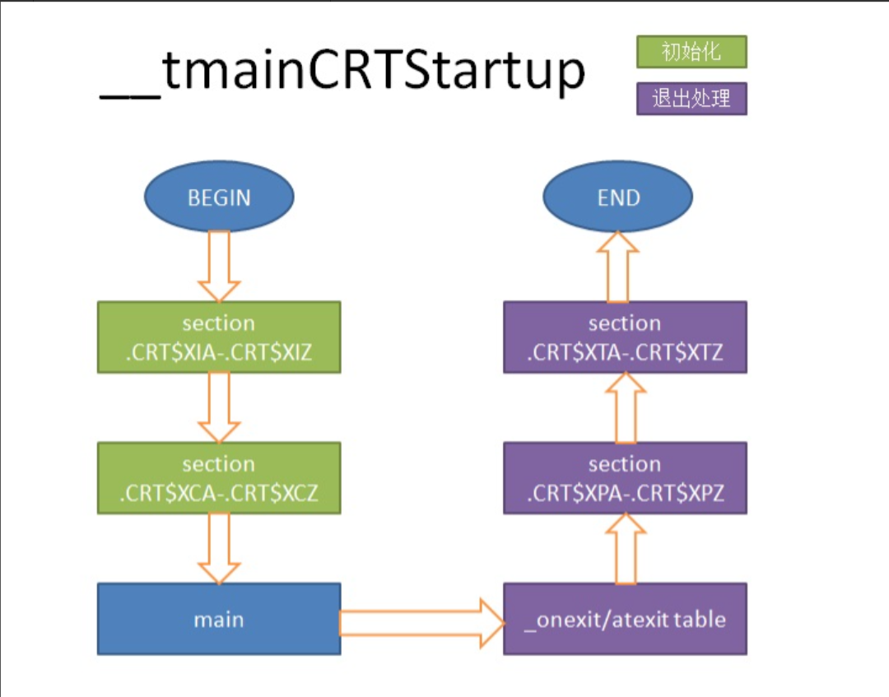
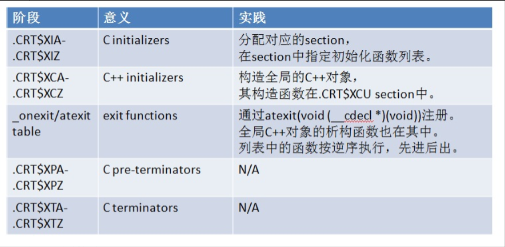
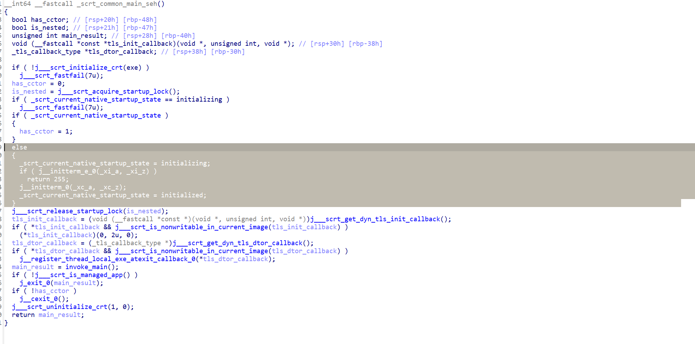
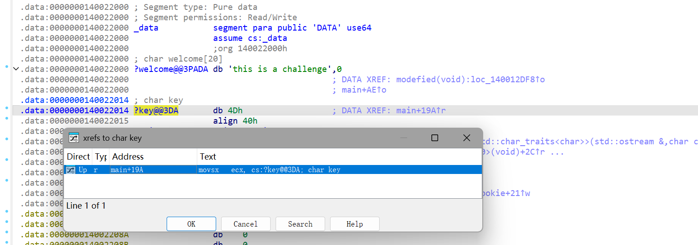
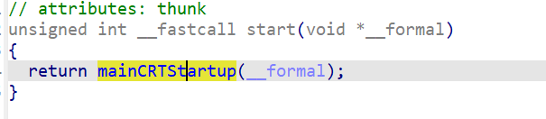
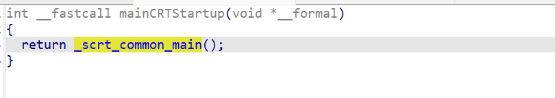
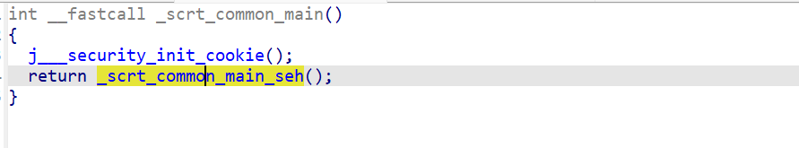

学习和参考文章：
[在main函数启动前和退出后执行代码 - shokey520 - 博客园](https://www.cnblogs.com/shokey520/p/3680804.html)

[[参考]mainCRTStartup分析 - 二氢茉莉酮酸甲酯 - 博客园](https://www.cnblogs.com/hed10ne/p/17527277.html)

[CRT 初始化 | Microsoft Learn](https://learn.microsoft.com/zh-cn/cpp/c-runtime-library/crt-initialization?view=msvc-170)


# 技术原理和实现

windows c/c++程序部分执行流程（不完整，只是为了方便理解crt初始化插入自定义代码的位置）

```
程序启动 
	↓ 
系统加载 EXE
	↓ 
进入 CRT 启动函数 _mainCRTStartup
	↓
CRT 初始化（初始化全局变量、堆、标准输入输出） 
	↓
【执行 .CRT$XCU 里的所有函数】 ← 核心！ 
	↓ 
调用 main 函数 
	↓ 
程序正常运行
```





在ida中显示的反编译代码如下：（可以自己随便写一个c/c++程序拖入ida看(加载pdb符号文件))


```c
  else
  {
    _scrt_current_native_startup_state = initializing;
    if ( j__initterm_e_0(_xi_a, _xi_z) )
      return 255;
    j__initterm_0(_xc_a, _xc_z);
    _scrt_current_native_startup_state = initialized;
  }
```
其中j__initterm_e_0 /j__initterm_0函数就是CRT初始化环节
[_initterm、_initterm_e | Microsoft Learn](https://learn.microsoft.com/zh-cn/cpp/c-runtime-library/reference/initterm-initterm-e?view=msvc-170)

程序会遍历调用(xi_a, xi_z) 和(xc_a, xc_z)的函数。xc_a到xc_z的函数指针表示例：
```c
.rdata:000000014001E000 __xc_a          dq 0                    ; DATA XREF: __scrt_common_main_seh+7F↑o
.rdata:000000014001E008                 dq 0
.rdata:000000014001E010                 dq 0
.rdata:000000014001E018                 dq 0
.rdata:000000014001E020                 dq 0
.rdata:000000014001E028                 dq 0
.rdata:000000014001E030                 dq 0
.rdata:000000014001E038                 dq 0
										.
										.
										.
										.
.rdata:000000014001E110 pre_cpp_initializer dq offset pre_cpp_initialization
										.
.rdata:000000014001E847                 dq 0
.rdata:000000014001E84F                 dq 0
										.
										
.rdata:000000014001E330 __xc_z          dq 0                    ; DATA XREF: __scrt_common_main_seh:loc_140015CF8↑o
```
然后我们就可以在函数指针表中插入自定义代码如:
```c
.rdata:000000014001E000 __xc_a          dq 0                    ; DATA XREF: __scrt_common_main_seh+7F↑o
.rdata:000000014001E008                 dq 0
.rdata:000000014001E010                 dq 0
.rdata:000000014001E018                 dq 0
.rdata:000000014001E020                 dq 0
.rdata:000000014001E028                 dq 0
.rdata:000000014001E030                 dq 0
.rdata:000000014001E038                 dq 0
										.
										.
										.
										.
.rdata:000000014001E110 pre_cpp_initializer dq offset pre_cpp_initialization
										.
.rdata:000000014001E847                 dq offset sub_411830
.rdata:000000014001E84F                 dq offset sub_411880
										.
										
.rdata:000000014001E330 __xc_z          dq 0                    ; DATA XREF: __scrt_common_main_seh:loc_140015CF8↑o
```

插入代码原理：

[CRT 初始化 | Microsoft Learn](https://learn.microsoft.com/zh-cn/cpp/c-runtime-library/crt-initialization?view=msvc-170)
省流版(ai生成)：
```
### 全局变量为啥在`main`前就赋值了？

看这段极简代码：

int func() { return 3; }
int gi = func(); // 全局变量
int main() { return gi; }

C++ 标准规定：**全局变量的初始化，必须在`main`函数开始前做完**。

那`func()`是谁调用的？答案：**CRT（C 运行时库）的启动代码**。

程序运行不是直接跳`main`，而是先跑 CRT 启动代码：

1. 初始化 CRT 自身
2. 执行所有全局变量的初始化（调用`func()`、类构造函数）
3. 最后才调用你写的`main`
   
###CRT 怎么找到所有全局初始化？（核心机制）
 编译器 + 链接器用了 **「分段 + 字母排序」** 的套路：

1. 编译器发现全局变量需要初始化，就把**初始化函数的地址**，放进一个专用区段：`.CRT$XCU`
2. CRT 提前埋了两个**标记**：
    
    - 开头标记：`.CRT$XCA`（叫`__xc_a`）
    - 结尾标记：`.CRT$XCZ`（叫`__xc_z`）
    
3. 链接器会把所有`.CRT`开头的区段，**按字母顺序排好**：
    
    `XCA` → `XCU` → `XCZ`
1. CRT 启动代码遍历`__xc_a`到`__xc_z`之间的所有地址，挨个执行，全局变量就都初始化完了。
```
然后我们要做的就是将自定义代码插入.CRT\$XCU 或者 .CRT\$XIU中
```
#pragma section(".CRT$XCU", read) 
__declspec(allocate(".CRT$XCU")) 
void(*p)() = modefied;//modefied为自定义函数
```
代码解析：

1.\#pragma: 编译器指令
- **全称**：Pragma Directive（编译指示）
- **作用**：**给编译器发「特殊命令」**，不生成程序代码，只控制**编译 / 链接行为**
- **特点**：
    
    - 编译器专属（这行只支持 VS/MSVC，GCC/Clang 不识别）
    - 不参与程序运行，只在编译时生效
    
- **通俗理解**：相当于给编译器递小纸条，告诉它「按我的要求创建节区」


2.`section`：定义 PE 节区

- **含义**：告诉编译器 **创建 / 声明一个新的节区（Section）**
- **什么是节区？**
    
    Windows exe/dll 是模块化结构，代码、数据、只读数据分开放：
    
    - `.text`：代码段
    - `.data`：全局变量
    - `.rdata`：只读数据
    - `.CRT$XCU`：CRT 初始化段
    
- **作用**：把你的函数指针，单独放在 CRT 规定的初始化节区里，让系统能找到它


3.第一个参数.CRT$XCU
 ① `.CRT`

- 固定前缀：代表这是 **CRT C 运行时** 的专用节区
- 所有 CRT 初始化函数都放在这个大类里

② `$`（美元符）

- **链接器排序符**，不是节区名的一部分！
- 链接器会**自动忽略 `$` 后面的字符**，把所有 `.CRT$xxx` 合并成一个 `.CRT` 节区
- 但！会**按照 `$` 后面的字母顺序排序执行**

③ `XCU`（执行顺序 + 用途）

- `X`：初始化分组
- `C`：C++ 初始化阶段
- `U`：User（用户自定义）
- 执行顺序：`.CRT$XCA`(系统) → ... → `.CRT$XCU`(用户) → `.CRT$XCZ`


4.第二个参数：`read`（节区内存属性）

**含义**：设置这个节区的**内存访问权限 = 只读** 


 5.`__declspec( ... )`

- **微软编译器专属扩展语法**
- 作用：给**变量 / 函数**加特殊属性
- 不是标准 C/C++，GCC 不支持
- 格式固定：`__declspec(关键字)`


6.`allocate`

- **含义**：分配、指定存放位置


7.void(\*p)() = modefied   

- 定义一个函数指针


总结就是通过#pragma section(".CRT\$XCU", read)告诉编译器创建一个.CRT\$XCU节区，然后再通过declspec改变函数指针的性质，把它强行放在了.CRT$XCU区中（一般情况下在全局中定义一个函数指针会把它放在.data节区 (全局变量) ）

你可能会有这样的疑问：创建的.CRT$XCU节区会不会和原本存在的.CRT\$节区冲突？ 这是不会的。
[section pragma | Microsoft Learn](https://learn.microsoft.com/zh-cn/cpp/preprocessor/section?view=msvc-170)
https://learn.microsoft.com/zh-cn/cpp/c-runtime-library/crt-initialization?view=msvc-170
[分配 | Microsoft Learn](https://learn.microsoft.com/zh-cn/cpp/cpp/allocate?view=msvc-170)
**如果多次使用 `section` 杂注指定相同的节名，只要每次指定的属性都相同，该操作就不会产生错误。**

**链接器会自动将数据合并到同一个节中。**

不仅可以把自定义代码插入.CRT$XCU节区，也可以插入.CRT\$XIU节区。


# 实际运用

## 1.简单地对全局变量进行修改

### 简单版
源代码：
```c
#include <iostream>
#include <Windows.h>
#include <stdint.h>
#include <stdlib.h>
using namespace std;

char key = 0x4d;

void modefied() {
	if (IsDebuggerPresent()) {
		return;
	}
	key = 0x5d;
	return;
}

#pragma section(".CRT$XCU", read)
__declspec(allocate(".CRT$XCU")) void(*p)() = modefied;

int main() {
	char buffer[256];
	char entext[] = { 59, 49, 60, 58, 38, 41, 53, 52, 46, 2, 60, 59, 49, 60, 58, 32 };
	cout << "please input your flag" << endl;
	cin >> buffer;
	int length = strlen(buffer);
	if (length != 16) {
		cout << "wrong length" << endl;
		return 0;
	}
	for (int i = 0; i < 16; i++) {
		buffer[i] = buffer[i] ^ key;
	}
	for (int i = 0; i < 16; i++) {
		if (buffer[i] != entext[i]) {
			cout << "wrong flag" << endl;
			return 0;
		}
	}
	cout << "correct flag" << endl;
	return 0;
}
```

简单的flag检验：对明文异或0x5d并与密文比较。其中一开始key被定义为全局变量0x4d，后面通过CRT初始化的modified函数对key魔改成0x5d。
如果直接在ida中点进key变量会跳转到.data节显示 0x4d
```
.data:0000000140022000 ?key@@3DA       db 4Dh                  ; DATA XREF: modefied(void):loc_140012DF8↑w
.data:0000000140022000                                         ; main+16B↑r
```
不过通过仔细观察或者交叉引用可以清楚的发现modefied函数调用了它并进行了魔改。

### 进阶版：
```c
#include <iostream>
#include <Windows.h>
#include <stdint.h>
#include <stdlib.h>
using namespace std;

char welcome[] = "this is a challenge";
char key = 0x4d;

void modefied() {
	if (IsDebuggerPresent()) {
		return;
	}
	char* key_addr = (char* )welcome + 0x14;
	*key_addr = 0x5d;
	return;
}

#pragma section(".CRT$XCU", read)
__declspec(allocate(".CRT$XCU")) void(*p)() = modefied;

int main() {
	char buffer[256];
	char entext[] = { 59, 49, 60, 58, 38, 41, 53, 52, 46, 2, 60, 59, 49, 60, 58, 32 };
	cout << welcome << endl;
	cout << "please input your flag" << endl;
	cin >> buffer;
	int length = strlen(buffer);
	if (length != 16) {
		cout << "wrong length" << endl;
		return 0;
	}
	for (int i = 0; i < 16; i++) {
		buffer[i] = buffer[i] ^ key;
	}
	for (int i = 0; i < 16; i++) {
		if (buffer[i] != entext[i]) {
			cout << "wrong flag" << endl;
			return 0;
		}
	}
	cout << "correct flag" << endl;
	return 0;
}
```

这个跟上一个的区别在于程序通过取welcome的地址，加上key和welcome的偏移定位到key地址并对其进行修改。这样的好处在于ida对key交叉引用时不会出现modified函数。不过通过动态调试获取key可以轻松识破这种小把戏（前提是过掉反调试检测）




## 2.配合其他技术

PE反射注入执行第二层PE，inlinehook跳转等等。这些技术在其他文章介绍。


## 3.在ida找到CRT自定义函数

可以自己写一个程序配合ida来看(加载.pdb符号信息)
从ida的start函数开始








```c
    if ( j__initterm_e_0(_xi_a, _xi_z) )
      return 255;
    j__initterm_0(_xc_a, _xc_z);
```

\_xi_a, \_xi_z和_xc_a, \_xc_z分别是c/c++的CRT初始化函数指针表的起始地址和终止地址。我们可以在这个范围内找到自定义函数。自定义函数在xi_a - xi_z 还是xc_a - xc_z 中看出题人注入的节区是.CRT$XCU还是.CRT\$XIU中。

自定义函数位置示例：
```c
.rdata:000000014001E000 __xc_a          dq 0                    ; DATA XREF: __scrt_common_main_seh+7F↑o
.rdata:000000014001E008                 dq 0
.rdata:000000014001E010                 dq 0
.rdata:000000014001E018                 dq 0
.rdata:000000014001E020                 dq 0
.rdata:000000014001E028                 dq 0
.rdata:000000014001E030                 dq 0
.rdata:000000014001E038                 dq 0
										.
										.
										.
										.
.rdata:000000014001E110 pre_cpp_initializer dq offset pre_cpp_initialization
										.
.rdata:000000014001E220 ; void (__fastcall *p)()
.rdata:000000014001E220 ?p@@3P6AXXZEA   dq offset j_?modefied@@YAXXZ ; modefied(void)
										.
										
.rdata:000000014001E330 __xc_z          dq 0                    ; DATA XREF: __scrt_common_main_seh:loc_140015CF8↑o
```

要注意的是做题的时候没有符号信息。所以静态分析很难分出哪个是自定义函数。所以可以采取动态调试配合分析。
